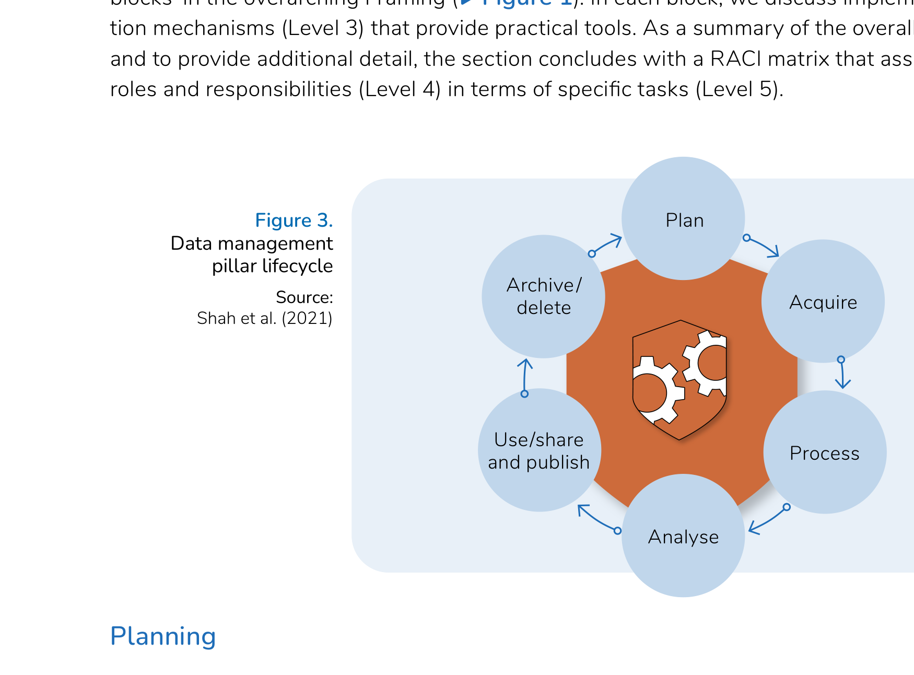

# Pillar 1: Management

Data management focuses on policies and procedures for efficiently and effectively collecting, processing, storing, and deleting data throughout its lifecycle. This pillar is structured around the six stages of the science data lifecycle (Shah et al., 2021).

Sound data management supports reliable operations, brings operational efficiency and regulatory compliance, and helps prevent erratic policy implementation and the reputational risks that follow.

## Building blocks

| Building block | What it covers |
|----------------|----------------|
| [Planning](planning.md) | Strategic framework for data management; the data management plan |
| [Acquisition](acquisition.md) | Policies and processes for collecting and receiving data |
| [Processing](processing.md) | Eligibility determination, processing workflows, and exit processes |
| [Analysis](analysis.md) | Data catalogue, impact assessments, and monitoring dashboards |
| [Use, sharing and publication](use-sharing-publication.md) | Covered under Pillar 3: Access |
| [Archiving and deletion](archiving-deletion.md) | Data retention policies and archiving practices |

## Why this pillar matters

Data management is a critical pillar of the proposed Data Governance Framework. It comprises six stages across the data lifecycle: (i) plan, (ii) acquire, (iii) process, (iv) analyse, (v) use and share/publish, and (vi) delete/archive. The use/share and publish building block is discussed under Pillar 3: Access. In each block, we discuss implementation mechanisms (Level 3) that provide practical tools. As a summary of the overall pillar and to provide additional detail, the section concludes with a RACI matrix that assigns roles and responsibilities (Level 4) in terms of specific tasks (Level 5).

## Roles overview

The primary actor for this pillar is the **data administrator (DA)**, with the **governance council (GC)** holding accountability across most mechanisms. **Data collectors (DC)**, **data providers (DP)**, **programme administrators (PA)**, and **IT services (IT)** are consulted or informed depending on the mechanism.

See [Roles and responsibilities](../roles-and-responsibilities.md) for full descriptions.

## Related pillars

- [Quality](../quality/README.md) — data quality depends on sound management practices at acquisition and processing stages
- [Access](../access/README.md) — use, sharing, and publication is addressed in the Access pillar
