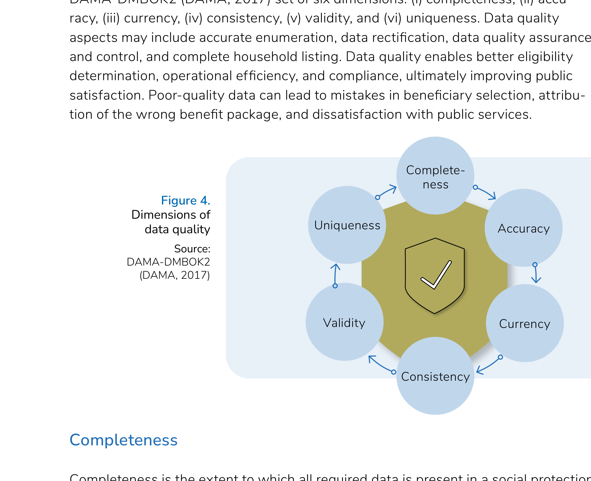

# Pillar 2: Quality

Data quality covers the procedures and processes that ensure data is accurate, consistent, complete, and reliable. This pillar draws on the six quality dimensions defined in the DAMA-DMBOK2 (DAMA, 2017), interpreted for digital social protection systems.

Poor data quality leads to errors in beneficiary selection, wrong benefit packages, and erosion of public trust. Good quality data enables better eligibility determination, operational efficiency, and compliance.

## Building blocks

| Building block | What it covers |
|----------------|----------------|
| [Completeness](completeness.md) | Ensuring all required data is present and all eligible individuals are included |
| [Accuracy](accuracy.md) | Ensuring data correctly represents the real-world attributes it describes |
| [Currency](currency.md) | Ensuring data is sufficiently up to date for its intended use |
| [Consistency](consistency.md) | Ensuring data is coherent across sources, systems, and time |
| [Validity](validity.md) | Ensuring data conforms to defined formats, ranges, and rules |
| [Uniqueness](uniqueness.md) | Ensuring each individual or record is represented only once |

## Why this pillar matters

Data quality deals with procedures and processes that ensure data is accurate, consistent, complete, and reliable. The building blocks of data quality are the DAMA-DMBOK2 (DAMA, 2017) set of six dimensions: (i) completeness, (ii) accuracy, (iii) currency, (iv) consistency, (v) validity, and (vi) uniqueness. Data quality aspects may include accurate enumeration, data rectification, data quality assurance and control, and complete household listing. Data quality enables better eligibility determination, operational efficiency, and compliance, ultimately improving public satisfaction. Poor-quality data can lead to mistakes in beneficiary selection, attribution of the wrong benefit package, and dissatisfaction with public services.

## Roles overview

Quality mechanisms involve a range of actors. **Data collectors (DC)** and **data administrators (DA)** carry primary operational responsibility. The **governance council (GC)** is accountable for quality standards. **Programme administrators (PA)** and **data providers (DP)** are consulted where their data or processes are affected.

See [Roles and responsibilities](../roles-and-responsibilities.md) for full descriptions.

## Related pillars

- [Management](../management/README.md) — acquisition and processing practices directly affect data quality
- [Access](../access/README.md) — data sharing arrangements require quality assurances for recipient organisations
