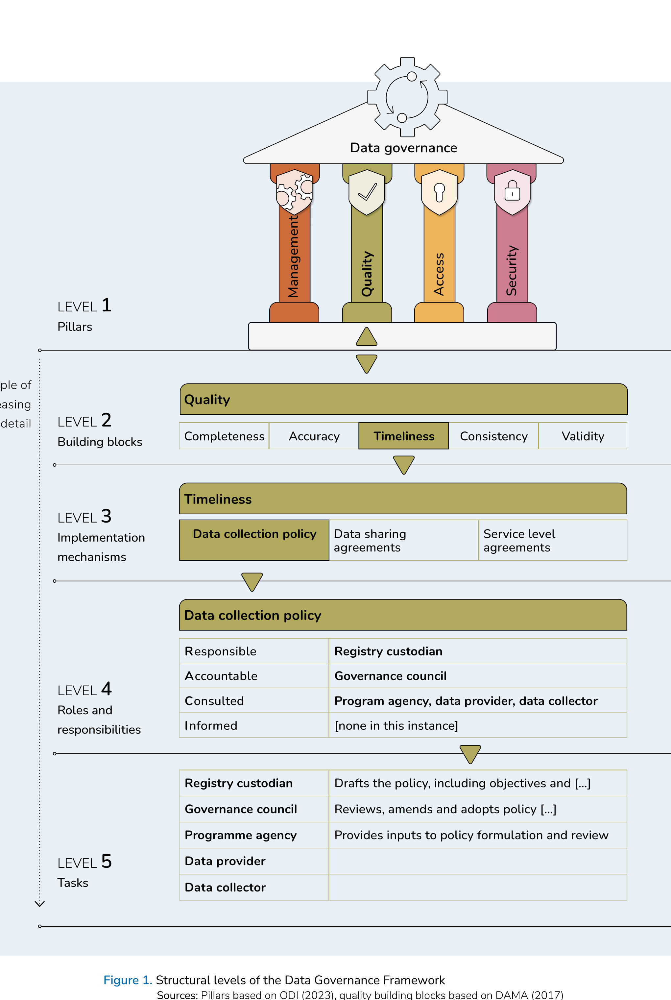

# Framework structure and levels

This overview section introduces the multi-tier structure of the proposed Data Governance Framework. A discussion of the pillars of data governance, down to the roles and responsibilities of the different actors in the process, completes the conceptual part of the overview. A summary table synthesises the content of this section in a compact format.

This report proposes a Framework with five levels of detail (as illustrated in Figure 1):

- **Level 1:** The first level is what we refer to as the pillars of data governance, or the major subject areas, which jointly ensure a comprehensive account of the field. These are management, quality, access, and security.

- **Level 2:** In the second level, each of the abstract pillars have several 'building blocks' that break the pillars down to more concrete areas. For instance, data quality can be decomposed into: completeness, accuracy, timeliness, consistency, and validity.

- **Level 3:** The third level of the Framework proposes concrete tools for operationalising the building blocks through implementation mechanisms. For instance, timeliness can be operationalised through appropriate data acquisition policies, data sharing agreements, and service level agreements.

- **Level 4:** The fourth level assigns specific tasks to particular actors (i.e., roles and responsibilities) in a typical social protection sector. As an example, the formulation of an acquisition policy for household interviews could be coordinated by the social registry as the actor responsible for designing the policy and drafting a policy paper, with the data governance council bearing ultimate accountability for the policy. The data collector would be consulted regarding the practical aspects of data collection in the local context, institutions that administer programmes would be consulted on their data needs, and other public data providers as well as public IT services would be consulted on a mechanism for discrepancy resolution in cases where household interviews reveal differences to existing records.

- **Level 5:** The final fifth level outlines key tasks involved in putting the implementation mechanisms into practice and assigns these to the various actors to provide a practical view of which actions need to be undertaken by which parties. These tasks are illustrative and need to be tailored to the specific implementation setting.

Figure 1 showcases the different levels by zooming into a particular example. Table 1 gives an overview of the full Framework.

