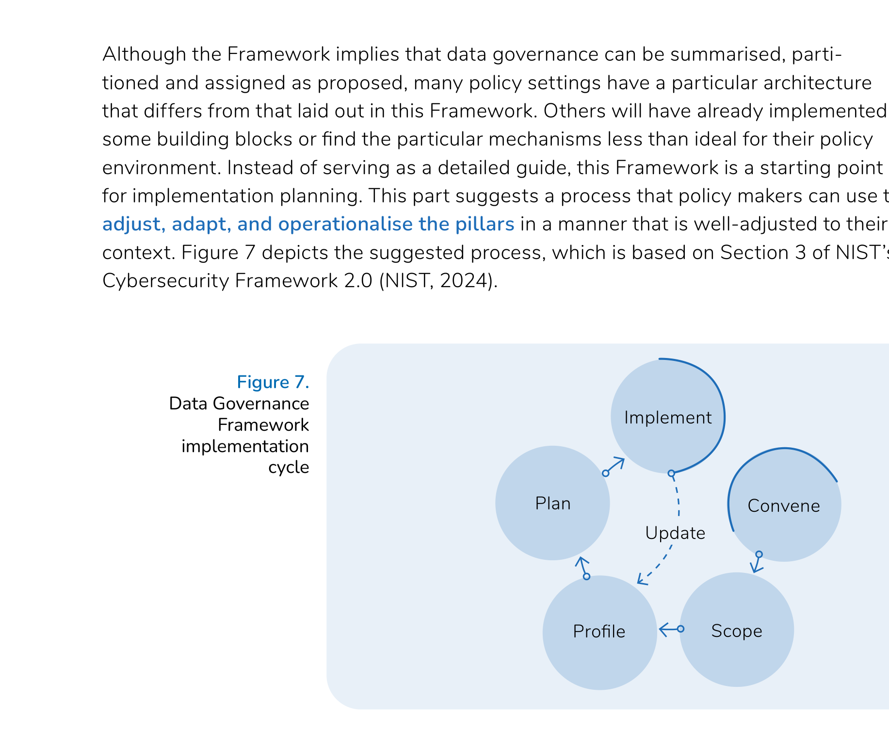

# Implementation guidance

Across four pillars, this Framework suggests many steps towards good data governance. The steps are formulated in general terms that make no reference to specific conditions, as they aim to cover the essential ground, wherever they may be applied. Accordingly, the Framework gains universality at the cost of specificity. Even if one is to accept fully that the pillars and building blocks are suitable for the realisation of policy objectives, it needs to be determined whether the implementation mechanisms are the best approach for a given setting, and how to break these down into particular operational actions. This part suggests a project management approach to Framework implementation.

## Implementation cycle

Although the Framework implies that data governance can be summarised, partitioned and assigned as proposed, many policy settings have a particular architecture that differs from that laid out in this Framework. Others will have already implemented some building blocks or find the particular mechanisms less than ideal for their policy environment. Instead of serving as a detailed guide, this Framework is a starting point for implementation planning. This part suggests a process that policy makers can use to adjust, adapt, and operationalise the pillars in a manner that is well-adjusted to their context.

The implementation cycle is presented in a structured and sequenced manner to describe the stages clearly. The reality of policy reform and implementation is much more adaptive and continuous than this 'linear cycle'; a responsive approach that is adaptive to evolving policy needs and stakeholder requirements should be embraced to ensure sustainable and well-adjusted policy outcomes. It is also important to note that many of the implementation mechanisms proposed in this Framework are on-going rather than once-off activities. For example, data access rights need to be set in line with job requirements and require immediate adjustment as staff transition to new roles or leave the organisation. Similarly, staff training needs to be conducted at regular intervals, data sharing agreements and service level agreements need to be adapted as circumstances evolve, policies require review, and ICT security must be kept up-to-date continuously, and so on. In short, the purpose of the implementation cycle is to build dynamic, live systems. The rest of this part discusses the steps involved, and we invite policy makers to consider them as part of the journey towards continuous improvement in data governance.

## The five steps

| Step | Title | Focus |
|------|-------|-------|
| [1](step-1-convene-stakeholders.md) | Convene stakeholders | Governance and accountability |
| [2](step-2-define-scope.md) | Define scope of the Framework | Policy and contextual fit |
| [3](step-3-profile-organisations.md) | Profile organisations | Current status and gaps |
| [4](step-4-plan-implementation.md) | Plan implementation | Prioritisation and project design |
| [5](step-5-implement.md) | Implement the plan | Project management and iteration |
